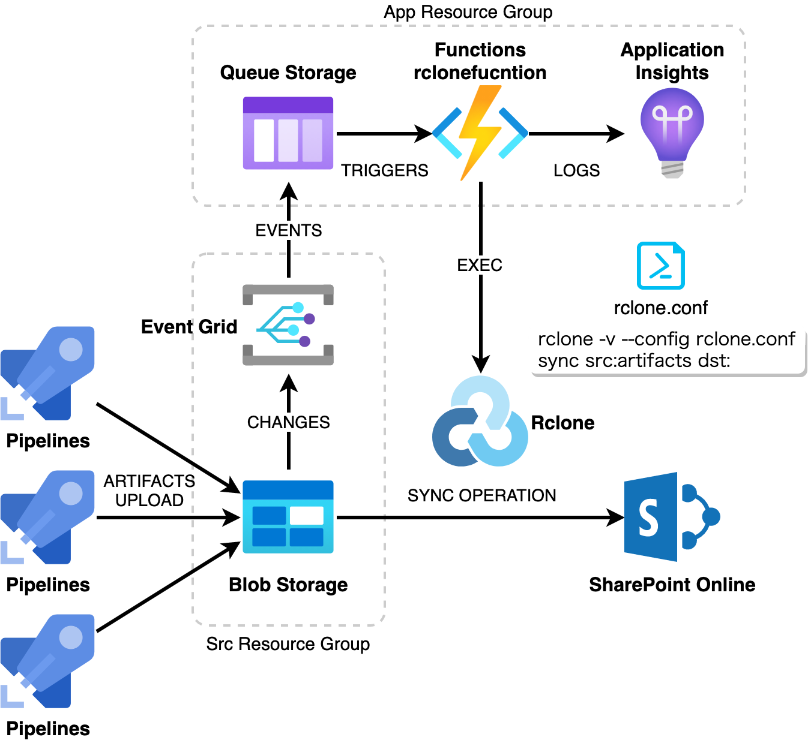

# rclonefunction

## Introduction

rclonefunction is an experimental Azure function with a custom handler written in Go.

It tries to watch and sync the changes in the content in the Azure storage blob container to another storage by launching [rclone].  You can suuply rclone.conf to specify the destination.  It can be any place as long as rclone can support.



## Deploy to Azure

You can try it out with the following Deploy to Azure button.

[](https://portal.azure.com/#create/Microsoft.Template/uri/https%3A%2F%2Fraw.githubusercontent.com%2Fyaegashi%2Frclonefunction%2Fmaster%2FARMTemplates%2Fmain.json)

Provide the following settings in the form.

- App RG Name: Resource group name for the function app and related resources.
- Src RG Name: Resource group name for the source storage account.
- Storage Account Name: Source storage account name.
- Storage Container Name: Enter `artifacts` for now.

After deploying it, you have to put your own rclone.conf in the `config` container in the storage account of App RG.  `rclone.conf` should have `[dst]` remote config for the destination.

```text
[dst]
type = onedrive
token = {"access_token":"...."}
drive_id = b!IcOpYe_........................
drive_type = documentLibrary
```

## References

- [rclonefunction](https://speakerdeck.com/yaegashi/rclonefunction) (Presentation in Japanese)

[rclone]: https://rclone.org
